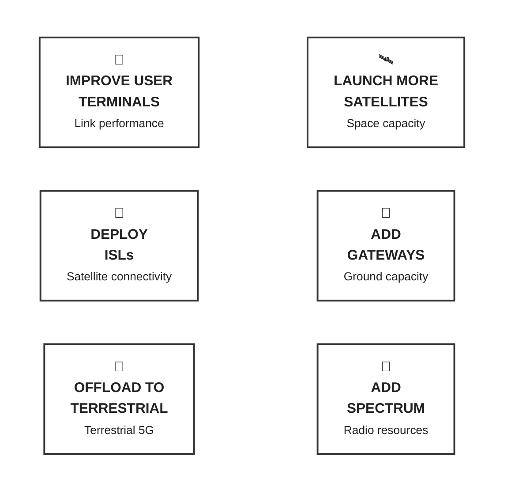
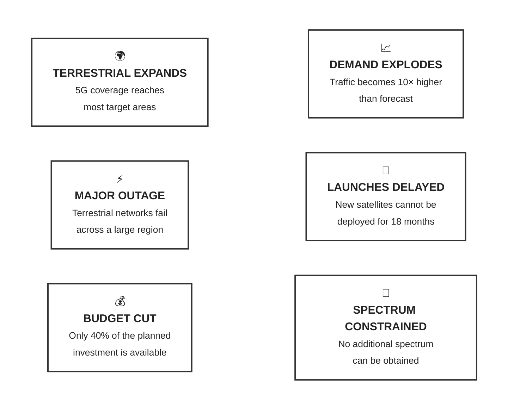

# Deployment strategies

## Deployment decisions

This activity aims at defining several deployment decisions based on several scenarios.

Activity flow:

1. Several discussion **groups** will be formed
2. Each group will be assigned a certain **scenario**
3. Task: choose multiple **decision options** among the ones listed below
4. Place the selected decision option cards in the order in which you would deploy them
5. Be prepared to answer:
   1. What is the reason behind your first decision option?
   2. What bottleneck does each decision address?
6. Each group will be given an event card (listed below)
7. How this event would disrupt your decision?
8. Would you reorder your deployment sequence? Explain why.

### Scenarios

| Group | Scenario                            | Likely pressure                  |
| ----- | ----------------------------------- | -------------------------------- |
| A     | Rural broadband, sparse population  | Coverage / capacity              |
| B     | Maritime connectivity               | No terrestrial network           |
| C     | Dense urban NTN                     | Spectrum / terrestrial offload   |
| D     | Disaster response                   | Rapid deployment / resilience    |
| E     | Global IoT network                  | Coverage / terminal cost         |
| F     | High-latency-sensitive applications | Connectivity architecture / ISLs |

### Decision options

### Event cards

